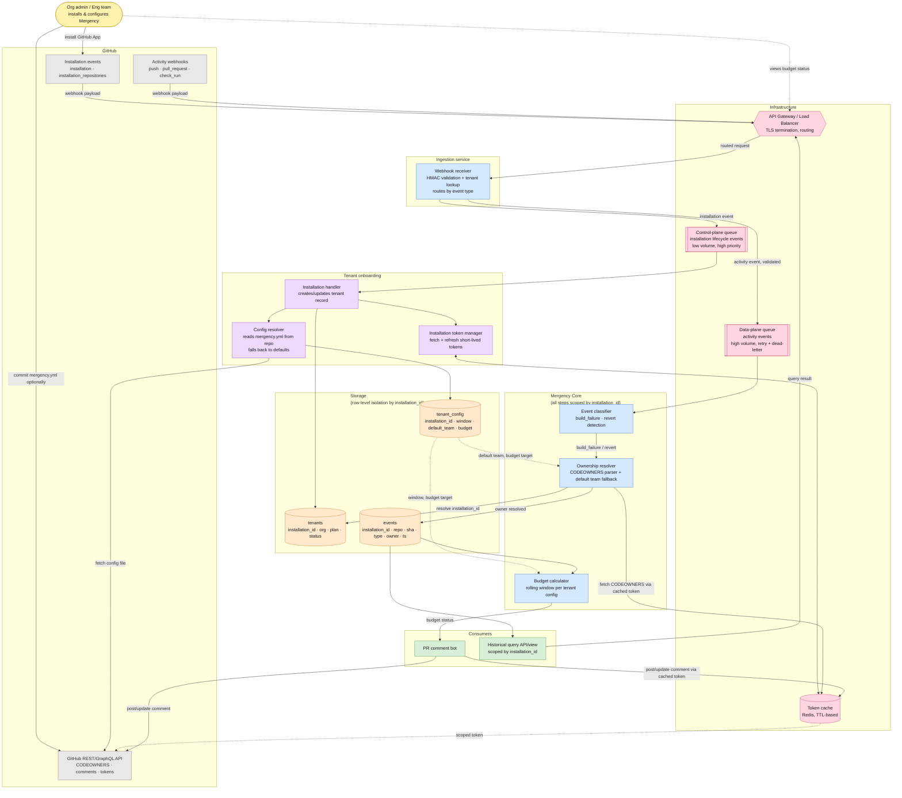

# Mergency architecture diagram

# Functional requirements
FR-INFRA1: The system must route every incoming GitHub webhook through a single entry point (API Gateway) before it reaches any internal service.
FR-INFRA2: The webhook receiver must classify each incoming event by type and route it to the correct queue: installation lifecycle events go to the control-plane queue, activity events (push, pull_request, check_run) go to the data-plane queue.
FR-INFRA3: The installation handler must only consume from the control-plane queue. It must never process activity events directly.
FR-INFRA4: The event classifier must only consume from the data-plane queue.
FR-INFRA5: The token manager must cache installation access tokens per tenant and serve them to any component that needs to call the GitHub API, instead of requesting a fresh token on every call.
FR-INFRA6: When a cached token is expired or missing, the token manager must transparently fetch a new one from GitHub and refresh the cache, without the calling component needing to know that happened.

# Non-functional requirements

NFR-INFRA1 (Isolation): A spike or outage on the data-plane queue must never block or delay processing on the control-plane queue. Installing or uninstalling the app must keep working even if activity processing is degraded.
NFR-INFRA2 (Throughput): The data-plane queue must be sized for high volume traffic (the whole premise of the project is more PRs coming from AI-assisted coding), while the control-plane queue can stay small since installs/uninstalls are rare by comparison.
NFR-INFRA3 (Reliability): Both queues must support retry with backoff, and the data-plane queue specifically must support a dead-letter mechanism, since losing an activity event silently would corrupt the budget calculation for that tenant.
NFR-INFRA4 (Latency): Reading a cached token must be fast enough (sub-10ms typically) that it doesn't become the bottleneck for the PR comment flow, which is the most latency-sensitive path in the system.
NFR-INFRA5 (Security): Tokens stored in the cache must be short-lived and scoped to a single installation. A cache compromise must never expose a token usable across tenants.
NFR-INFRA6 (Cost/complexity trade-off): Splitting the queue by plane adds one more moving part to operate. This decision should be revisited if actual traffic doesn't justify it yet (documented as a reversible decision, not a permanent architectural constraint).

📝 One thing worth calling out separately, since it's easy to lose in a diagram: NFR-INFRA1 is really the reason the two-queue split exists at all. If that requirement didn't matter to you, a single queue would be simpler and you shouldn't have split it. Worth keeping that link visible wherever this list lives next to the diagram.

